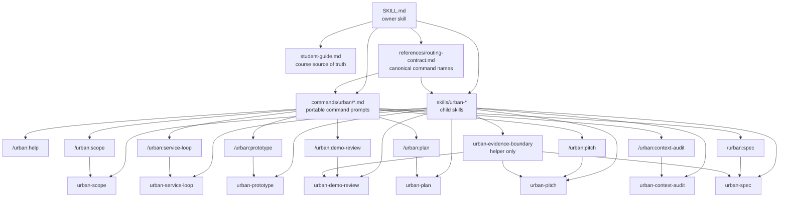

# Urban Command Skill Concept Map

이 문서는 `urban-prototyping-coach` 패키지의 owner skill, child skill, command surface가 어떻게 연결되는지 한눈에 보여 주는 정렬 표면입니다.

## Map

## Reading Rules

- owner skill은 전체 수업 흐름과 출력 문법을 소유합니다.
- `student-guide.md`는 개념과 수업 흐름의 source of truth입니다.
- `references/routing-contract.md`는 command spelling과 child skill 연결의 source of truth입니다.
- `commands/urban/*.md`는 복사해 붙여 넣기 쉬운 portable command surface입니다.
- `skills/urban-*`는 각 단계의 좁은 작업 단위를 소유합니다.
- `urban-evidence-boundary`는 단독 단계가 아니라 다른 단계 뒤에 붙는 helper입니다.
