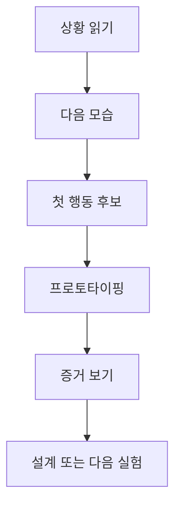
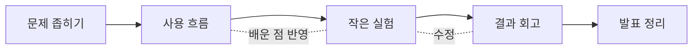

# How to build with LLM

## LLM으로 아이디어를 작게 실험하는 법

> 아이디어는 있는데 바로 만들기에는 아직 애매할 때가 있습니다.
> **아이디어를 크게 만들기 전에, 사용자가 반응하는지 작은 실험으로 먼저 확인합니다.**
>
> 이 교재는 LLM(ChatGPT, Claude 같은 AI 도구)로 그 실험을 작게 만들고, 실제 반응을 보며 다음 설계를 정하는 방법을 다룹니다.
>
> 목표는 큰 서비스를 한 번에 완성하는 것이 아닙니다.
> 먼저 무엇을 확인할지 정하고, 사용자 반응을 증거로 남기는 것이 목표입니다.
>
> 신청 버튼 하나, 샘플 리포트 하나, 짧은 인터뷰 질문처럼 오늘 바로 해볼 수 있는 형태로 시작합니다.

---

## 먼저 알아두면 좋은 말

- **프로토타이핑**: 아이디어를 작게 만들어 사람 반응을 확인하는 일
- **프로토타입**: 확인하고 싶은 질문에 답하기 위해 만든 작은 실험물
- **LLM**: 가설 정리, 실험 초안 작성, 기록 정리를 빠르게 도와주는 언어모델
- **증거**: 클릭, 신청, 재사용, 인터뷰 반응, 관찰 메모처럼 다음 판단에 도움이 되는 신호
- **머릿속으로 한 번 돌려보기**: 실제로 만들기 전에 다음 장면을 짧게 상상해 막히는 곳을 찾아보는 일

이 교재는 어려운 이론 이름보다 작업 장면을 먼저 다룹니다.
처음에는 **상황 보기 -> 작게 시험하기 -> 증거 남기기**만 잡으면 충분합니다.

---

## 이 문서를 읽는 방법

이 문서는 사전처럼 한 번에 외우기 위한 문서가 아닙니다.
오히려 한 프로젝트를 진행하면서 **앞에서 읽고, 해보고, 다시 돌아와 읽는 문서**에 가깝습니다.

처음 읽을 때는 아래 다섯 가지만 잡아도 충분합니다.

1. 프로토타이핑은 완성품 제작이 아니라 **학습을 위한 실험**이라는 점
2. 완벽한 답을 찾기보다 `지금 해볼 수 있는 다음 행동`을 찾는다는 점
3. 큰 목적보다 **다음에 되어야 할 모습**을 잡아야 실험이 작동한다는 점
4. LLM은 실험 속도를 높여주지만 **증거를 대신하지는 못한다**는 점
5. 배운 것을 기록해야 다음 설계로 넘어갈 수 있다는 점

처음부터 끝까지 한 번에 읽어야 하는 문서는 아닙니다.
상황에 따라 이렇게 들어오면 좋습니다.

- 처음 읽을 때는 `0. 출발점`부터 `6. 무엇을 증거로 볼까?`까지 읽습니다.
- 이미 프로젝트를 시작했다면 `4. 어떤 작은 실험을 고를까`부터 `7. 키트의 기본 구성`까지 필요한 구간만 봐도 됩니다.
- 발표나 정리 직전에는 마지막 `11. 강의에서 바로 쓸 설명`과 `12. 어디까지 확실히 말할 수 있나`를 다시 봅니다.

---

## 이 문서의 기준

- 프로토타이핑은 **예쁘게 만드는 일**보다 **무엇을 확인할지 정하고 작게 시험하는 일**에 가깝습니다.
- 방식 이름은 외우는 대상이 아닙니다. 먼저 확인할 질문 하나를 정합니다.
- 관심을 볼 때는 아직 없는 기능에 문만 먼저 만드는 방식(Fake Door)을 씁니다.
- 결과물의 가치를 볼 때는 사람이 직접 해주거나(Concierge), 손으로 만든 첫 리포트(Manual-first Report)를 씁니다.
- 흐름을 볼 때는 자동화 흉내 실험(Wizard of Oz)이나 종이 화면 또는 역할극(Paper / Role-play)을 씁니다.
- 실제 입력과 결과를 볼 때는 아주 작은 작동형 도구(Tiny Functional Prototype)를 씁니다.
- 배경 이론은 뒤로 보내고, 독자가 바로 쓸 수 있는 질문과 실험 순서를 먼저 다룹니다.
- LLM은 가설 정리, 실험 초안, 기록 정리, 설계 연결에 강하지만, **현실 사용자 증거를 대신하지는 못합니다**. 여기서 증거는 클릭, 신청, 질문, 재사용, 관찰 메모처럼 남는 행동이나 기록입니다.
- 프로젝트 폴더는 단순 저장소가 아니라, **LLM과 사람이 함께 읽는 작업 기록**입니다.
- 실행할 때의 기본 흐름은 보통 이렇습니다.
  **상황 읽기 -> 다음 모습 정하기 -> 첫 행동 -> 작은 실험 -> 증거 -> 설계**

즉, 이 문서는 "LLM으로 바로 코드를 만드는 법"보다
**LLM으로 더 잘 배우고, 더 나은 것을 만들기 시작하는 법**에 더 가깝습니다.

---

## 완료 기준

이 교재는 끝까지 읽었는지보다, 읽고 나서 무엇을 더 분명하게 말할 수 있는지를 기준으로 닫습니다.

### 반드시 확인할 것

1. 지금 보는 상황과 다음에 되어야 할 모습을 각각 한 문장으로 말할 수 있다.
2. 선택한 프로토타입이 어떤 질문에 답하는지와 무엇을 증거로 볼지 연결할 수 있다.
3. 기준에 아직 못 미치면 짧게 회고하고, 배운 점을 반영해 다음 실험을 조정할 수 있다.

### 되면 더 좋은 것

1. 상황, 작은 실험, 증거 같은 말을 자기 프로젝트 장면으로 설명할 수 있다.
2. 만든 결과물보다 새로 확인한 판단과 다음 행동을 더 선명하게 남길 수 있다.

이 기준을 통과하지 못하면 실패로 닫지 않습니다.
그때는 **보고 고치기(Feedback and Adapt)**, 즉 진행하면서 확인한 것을 보고 다음 실험을 의도적으로 줄이거나 바꿉니다.

### 증거 기록 3줄

완료 기준이 아직 흐리면 긴 보고서보다 아래 세 줄을 먼저 남깁니다.
글을 더 쓰기보다, 진행하면서 확인한 판단을 눈에 보이게 정리하는 일입니다.

1. **오늘 본 상황**: 누가 어떤 장면에서 막히거나 반응했는지 적습니다.
2. **시험한 작은 행동**: 어떤 프로토타입 방식으로 무엇을 확인했는지 남깁니다.
3. **다음에 바꿀 점**: 관찰을 바탕으로 줄일 것, 바꿀 것, 다시 물어볼 것을 하나만 정합니다.

---

## 0. 출발점

아이디어가 떠오르면 본능적으로 이렇게 생각하기 쉽습니다.

> "이거 괜찮다. 바로 만들어보자."

그런데 실제로는 그 사이에 질문이 더 들어가야 합니다.

1. **사람들이 이걸 정말 원하나?**
2. **이 흐름이 자연스럽게 작동하나?**
3. **정말 만든다면 어떤 방식으로 구현해야 하나?**

그래서 이 교재에서는 여기에 한 질문을 더 붙입니다.

- **지금 나는 무슨 상황을 보고 있나?**
- **다음에 어떤 모습이 되어야 하나?**
- **지금 떠오른 한 걸음이 맞나?**

이 문서의 핵심은 간단합니다.

> **아이디어를 크게 만들기 전에, 사용자가 반응하는지 작은 실험으로 먼저 확인합니다.**

처음에는 보통
완성 화면을 먼저 상상하고,
곧바로 기능 목록을 적기 쉽습니다.

그렇게 하면 작업량은 늘지만,
아직 답하지 못한 질문은 남아 있습니다.

- 사람들이 이 문제를 실제로 불편해하는가?
- 지금 설명 방식이 이해되는가?
- 사용자는 이 흐름을 따라올 수 있는가?
- 이 기능 중 꼭 필요한 것은 무엇인가?

이 교재는 그 사이에 필요한 질문을 함께 붙잡기 위해 만들었습니다.

---

## 1. 왜 바로 만들기 전에 작은 실험부터 할까

프로젝트를 시작하면 정보가 늘 충분하지 않습니다.
보통 이런 상황이 먼저 옵니다.

- 시간이 충분하지 않습니다.
- 정보가 완전하지 않습니다.
- 상황이 계속 바뀝니다.
- 여러 사람이 얽혀 있습니다.
- 잘못 만들면 시간과 에너지를 크게 씁니다.

이런 환경에서는 사람들이
모든 대안을 길게 비교하고,
점수를 매기고,
가장 좋은 답을 계산해서 움직이기 어렵습니다.

경험 있는 사람들은 보통 이렇게 움직입니다.

1. **상황을 먼저 읽는다**
2. **경험에 비춰 그럴듯한 첫 행동 후보를 떠올린다**
3. **그 행동이 통할지 머릿속으로 한 번 돌려본다**
4. **큰 문제가 없어 보이면 실행한다**

그래서 여기서 중요한 것은 `최적의 답 찾기`보다
`지금 이 상황에서 해볼 수 있는 다음 행동 찾기`에 가깝습니다.

### 왜 "목적지"보다 "다음 모습"이 중요한가

처음에는 자주 이렇게 묻습니다.

> "내 목적지는 어디지?"

필요한 질문이지만,
질문이 너무 커지면 실제 행동이 멈춥니다.

이렇게 줄이면 질문은 더 행동에 가까워집니다.

- 나는 어디로 가는가?
  -> 이 상황에서 **다음에 어떤 모습이 되어야 하는가?**
- 무엇을 만들 것인가?
  -> 그 모습을 만들 **첫 행동은 무엇인가?**
- 이게 맞는가?
  -> 그 한 걸음을 **어떻게 가장 작게 시험할 것인가?**

### 사용자의 질문을 쉬운 실행 언어로 바꾸면

- `지금 내가 뭘 하는지?`
  -> 지금 상황을 읽고, 무슨 일이 벌어지는지 정리하는 질문입니다.
- `내가 목적지로 삼는 데는 어디지?`
  -> 먼 목표보다 바로 다음에 되어야 할 모습을 정하는 질문입니다.
- `이게 맞나?`
  -> 지금 떠오른 행동이 통할지 먼저 작게 확인하는 질문입니다.

### 여러 장면으로 쪼개기

상황을 한 번에 다 보려고 하면 다시 커집니다.
그래서 먼저 장면을 나눕니다.

1. 사용자가 문제를 말하는 장면
2. 버튼, 폼, 샘플을 처음 보는 장면
3. 직접 입력하거나 신청하는 장면
4. 결과를 보고 계속할지 멈출지 정하는 장면

오늘은 이 중 한 장면만 고릅니다.
그 장면에서 사용자가 무엇을 하는지 봅니다.
그 행동을 증거로 남깁니다.

장면마다 볼 증거도 다릅니다.

| 장면 | 볼 행동 | 남길 기록 |
| --- | --- | --- |
| 문제를 말하는 장면 | 어떤 불편을 자기 말로 꺼내는가 | 반복해서 나온 표현 한두 개 |
| 처음 보는 장면 | 버튼, 폼, 샘플 앞에서 멈추거나 묻는가 | 클릭, 머뭇거림, 질문 |
| 입력하거나 신청하는 장면 | 끝까지 입력하고 제출하는가 | 제출 수, 중간 이탈 위치 |
| 계속할지 멈출지 정하는 장면 | 다시 요청하거나 포기하는가 | 재요청, 저장, 이탈 메모 |

즉, 여기서 프로토타이핑은 단순한 자기점검이 아니라,
**내가 상황을 어떻게 보고 있는지 작은 실험으로 확인하는 작업**에 가깝습니다.

### 프로토타입은 여기서 왜 필요한가

머릿속 판단은 빠르지만 흐릿합니다.
프로토타입은 그 흐릿한 생각을 눈에 보이게 만듭니다.

그래서 프로토타이핑은 보통 세 가지를 해줍니다.

1. 보이지 않던 생각을 화면, 문장, 흐름으로 바꾼다
2. 머릿속으로만 생각하던 다음 장면을 더 구체적으로 만든다
3. 다른 사람과 함께 검토할 수 있게 만든다

즉, 프로토타입은 머릿속 생각을 대신하는 것이 아니라
**그 판단을 더 구체적으로 확인하게 해주는 도구**입니다.

---

## 2. 프로토타이핑이란?

이 문서에서 말하는 프로토타이핑은
완성품을 만들기 전,
아이디어를 작은 형태로 만들어 반응을 보며 배우는 모든 실험을 가리킵니다.

중요한 점은 하나입니다.

> **프로토타이핑은 "예쁘게 시제품을 만드는 일"이 아니라 "무엇을 배울지 정하고 작게 시험하는 일"입니다.**

그래서 프로토타이핑은 한 가지 질문만 다루지 않습니다.
상황에 따라 서로 다른 질문에 답할 수 있습니다.

| 보고 싶은 것 | 던지는 질문 | 예시 |
| --- | --- | --- |
| 가치 | 사람들이 이 문제를 실제로 불편해하나? | 신청 버튼, 샘플 결과물 |
| 사용 흐름 | 입력하고 결과를 보는 과정이 자연스러운가? | 종이 화면, 역할극, 뒤에서 사람이 처리하는 자동화 흉내 |
| 구현 방향 | 정말 만든다면 어떤 기능과 구조가 필요한가? | 단일 HTML/JS 도구, 작은 앱, CLI 초안 |

즉, 프로토타이핑은 한 번으로 끝나는 단계가 아니라,
**질문이 바뀔 때마다 다른 형태로 계속 이어지는 과정**입니다.

여기서 중요한 차이를 하나 더 분명히 해두면 좋습니다.

| 구분 | 프로토타입 | 최종 서비스 |
| --- | --- | --- |
| 목적 | 배우기 | 안정적으로 제공하기 |
| 범위 | 필요한 만큼만 작게 | 실제 사용을 감당할 만큼 충분히 |
| 완성도 | 질문에 답할 정도면 충분 | 오류 대응, 운영, 유지보수까지 필요 |
| 평가 기준 | 무엇을 배웠는가 | 얼마나 잘 작동하는가 |

그래서 좋은 프로토타입은 "많이 만든 것"이 아니라
**핵심 질문 하나를 분명히 겨냥한 것**입니다.

---

## 3. 큰 흐름

```text
상황 읽기
  ↓
다음 모습 정하기
  ↓
첫 행동 후보 잡기
  ↓
가장 작은 프로토타입 고르기
  ↓
증거 보기
  ↓
설계 또는 다음 실험으로 이동
```



이 흐름을 제품 개발 말로 바꾸면 이렇게 볼 수 있습니다.

| 단계 | 핵심 질문 | LLM이 거드는 일 |
| --- | --- | --- |
| 상황 읽기 | 지금 무슨 일이 벌어지고 있나? | 막연한 상황 설명을 한 문장으로 줄이기 |
| 다음 모습 | 바로 다음에 어떤 모습이 되어야 하나? | 다음 모습을 한 문장으로 정리하기 |
| 첫 행동 | 무엇을 먼저 해볼 것인가? | 실험 후보 몇 가지 제안하기 |
| 프로토타이핑 | 무엇으로 가장 작게 시험할 것인가? | 화면, 폼, 문구, 흐름 초안 만들기 |
| 증거 보기 | 무엇을 보면 배웠다고 말할 수 있나? | 관찰 항목과 기록 포맷 정리하기 |
| 설계/반복 | 이제 무엇을 유지, 수정, 확장할 것인가? | 다음 액션과 설계 메모 정리하기 |

중요한 순서는 이것입니다.

> **먼저 배운다. 그다음 설계한다.**

완료 기준 없이 설계부터 들어가면,
아직 확인되지 않은 아이디어에 필요한 것보다 큰 노력을 쓰게 됩니다.

### 완료 기준이 흐릴 때 생기는 일

첫째, **아직 확인되지 않은 기능에 시간을 너무 많이 씁니다.**

둘째, **문제를 확인하기 전에 해결책 설명이 길어집니다.**

셋째, **만든 것은 남지만 배운 점이 흐려집니다.**

수업에서는 특히 이 차이가 큽니다.
만든 화면은 보여주기 쉽지만,
배운 점이 정리되지 않으면 다음 단계의 설계 근거가 약해집니다.

그래서 계속 같은 질문을 붙잡아야 합니다.

> **지금 우리는 무엇을 만들고 있는가가 아니라, 무엇을 새로 확인했는가?**

---

## 4. 어떤 작은 실험을 고를까

도시 문제나 지속가능발전목표(SDGs)처럼 큰 주제도,
바로 만들려고 하면 너무 큽니다.
먼저 확인할 판단 하나로 줄입니다.
그 판단을 오늘 볼 수 있는 질문으로 바꿉니다.
예를 들어 "사람들이 이 버튼을 누를까?"처럼 적습니다.

| 큰 아이디어 | 먼저 볼 질문 |
| --- | --- |
| 주차 공유 앱 | 사람들이 실제로 "빈 주차공간 알림 신청" 버튼을 누를까? |
| 동네 데이터 리포트 | 샘플 리포트를 읽고 다음 리포트를 요청할까? |
| 폐기물 수거 매칭 | 자동화 없이 폼과 단톡방만 있어도 사람들이 이용할까? |
| 에너지 절약 서비스 | 사용자가 생활 습관을 입력하고 미션을 받아보려 할까? |
| 교통약자 이동 안내 | 사용자가 이 안내를 실제로 유용하다고 느낄까? |

큰 아이디어는 보통 여러 장면을 품고 있습니다.
아래처럼 장면을 먼저 나누면 질문이 더 작아집니다.

| 큰 아이디어 | 먼저 고를 장면 | 오늘 볼 행동 | 오늘 남길 기록 |
| --- | --- | --- | --- |
| 주차 공유 앱 | 빈 주차공간 알림 버튼을 보는 장면 | 신청 버튼을 누르는가 | 클릭 수, 신청 수 |
| 동네 데이터 리포트 | 샘플 리포트를 처음 읽는 장면 | 다음 리포트를 요청하는가 | 요청 문장, 이메일 |
| 폐기물 수거 매칭 | 폼을 쓰고 단톡방으로 연결되는 장면 | 폼 제출 후 대화가 이어지는가 | 제출 수, 대화 시작 여부 |
| 에너지 절약 서비스 | 생활 습관을 입력하는 장면 | 입력을 끝까지 마치는가 | 완료 수, 중간 이탈 위치 |
| 교통약자 이동 안내 | 안내 문장을 보고 길을 고르는 장면 | 다른 안내를 더 요청하는가 | 추가 질문, 저장 여부 |

방식 이름이 많아 보여도, 출발점은 항상 같습니다.

> **지금 무엇을 배우고 싶은가?**

### 1) 아직 없는 기능에 문만 먼저 만들기(Fake Door)

아직 기능이나 서비스가 없지만, 마치 있는 것처럼 버튼이나 신청 페이지를 둡니다.

확인할 수 있는 것:

- 사람들이 관심을 보이는가?
- 어떤 문구에 더 반응하는가?
- 어떤 문제 설명이 더 설득력 있는가?

### 2) 자동화 전에 사람이 직접 해주기(Concierge)

자동화를 만들기 전에, 사람이 직접 서비스를 제공합니다.

확인할 수 있는 것:

- 결과물 자체가 유용한가?
- 어떤 부분을 가장 좋아하거나 불편해하는가?
- 나중에 자동화할 만한 반복 작업이 있는가?

### 3) 겉은 자동, 뒤는 사람이 처리하기(Wizard of Oz)

겉으로는 자동화된 서비스처럼 보이지만, 뒤에서는 사람이 일부를 처리합니다.

확인할 수 있는 것:

- 사용자가 이런 흐름을 편하게 느끼는가?
- 입력과 출력의 구조가 자연스러운가?
- 나중에 자동화해야 할 핵심 단계가 무엇인가?

### 4) 손으로 만든 첫 리포트(Manual-first Report)

도시 데이터 서비스에 특히 잘 맞습니다.
처음부터 대시보드를 만들 필요는 없습니다.
엑셀, 공공데이터, 검색 자료, AI 요약을 조합해서 **샘플 리포트 1개**를 먼저 만들 수 있습니다.

확인할 수 있는 것:

- 사람들이 리포트를 읽는가?
- 다음 리포트를 요청하는가?
- 어떤 정보가 실제 의사결정에 도움이 되는가?

### 5) 종이 화면 또는 역할극(Paper / Role-play)

서비스 화면을 종이에 그리거나,
팀원들이 사용자와 시스템 역할을 나눠 연기합니다.

확인할 수 있는 것:

- 서비스 흐름이 자연스러운가?
- 사용자가 어디서 막히는가?
- 어떤 입력과 출력이 필요한가?

### 6) 아주 작은 작동형 도구(Tiny Functional Prototype)

작게라도 실제로 작동하는 버전을 만듭니다.

예:

- 단일 HTML 페이지
- Streamlit 미니 앱
- 간단한 CLI 도구
- 입력값에 따라 결과가 달라지는 계산기

확인할 수 있는 것:

- 사용자가 스스로 입력하고 결과를 이해하는가?
- 어떤 기능이 꼭 필요하고 어떤 기능은 나중으로 미뤄도 되는가?
- 실제 구현으로 넘어갈 때 기술 구조를 어떻게 잡아야 하는가?

### 어떤 질문이면 어떤 방식을 먼저 쓰나?

이 구간은 순서대로 외우는 목록이 아닙니다.
지금 확인하고 싶은 질문에 맞춰 필요한 방식만 골라 봐도 됩니다.

| 지금 알고 싶은 것 | 먼저 시도할 방식 |
| --- | --- |
| 사람들이 관심을 보이는가 | 아직 없는 기능에 문만 먼저 만들기 |
| 결과물 자체가 유용한가 | 사람이 직접 해주기, 손으로 만든 첫 리포트 |
| 사용 흐름이 자연스러운가 | 겉은 자동처럼 보이고 뒤는 사람이 처리하기, 종이 화면 또는 역할극 |
| 실제 작동형 도구가 필요한가 | 아주 작은 작동형 도구 |

또 하나 기억할 점은,
이 방식들은 서로 경쟁하는 방식이 아니라 **이어지는 방식**이라는 것입니다.

1. 먼저 버튼이나 신청 페이지로 관심을 본다.
2. 사람이 직접 해주면서 결과물의 가치를 본다.
3. 자동화된 것처럼 보이는 흐름으로 사용 과정을 본다.
4. 아주 작은 작동형 도구로 구현 방향을 본다.

즉, 프로토타이핑은 "한 번 선택하고 끝"이 아니라
**질문이 달라질 때마다 실험 방식도 바뀌는 연속 과정**입니다.

---

## 5. LLM이 도움이 되는 구간

LLM은 프로토타이핑에서 특히 도움이 됩니다.
막연한 판단을 문장, 화면, 질문으로 빨리 바꿔볼 수 있기 때문입니다.

도울 수 있는 일:

- 상황 설명을 한 문장으로 줄이기
- 다음 모습을 정리하기
- 프로토타입 방식 몇 가지 제안하기
- 입력 폼, 랜딩페이지, 결과 화면 초안 만들기
- 인터뷰 질문이나 관찰 포인트 만들기
- 실험 후 배운 점을 정리하기
- 다음 설계 문서 초안 만들기

하지만 LLM이 대신할 수 없는 것도 분명합니다.

- 실제 사용자의 반응
- 현장의 맥락 신호
- 어디서 머뭇거리는지 같은 행동의 질감
- 다시 쓰는지, 포기하는지 같은 현실 증거

즉, LLM은 판단을 **보이는 형태로 바꾸는 속도**를 높일 수는 있지만,
그 판단이 현실에서 맞는지 확인하는 일까지 대신해주지는 못합니다.

### LLM에게 이렇게 요청하면 좋습니다

LLM은 막연한 요청보다,
장면과 질문이 분명한 요청에서 더 잘 작동합니다.

```text
지금 상황은 이렇다:
[상황 한 문장]

다음에 되어야 할 모습은 이렇다:
[다음 모습 한 문장]

우리가 지금 확인하고 싶은 것은:
[관심 신호 / 흐름 / 작동 구조 중 하나]

이걸 가장 작게 시험할 수 있는 프로토타입 3가지를 제안해줘.
각 제안마다
1) 무엇을 배울 수 있는지
2) 무엇을 증거로 볼지
3) 너무 크게 만들지 않으려면 어디까지 줄여야 하는지
를 함께 써줘.
```

### LLM 답만으로는 닫기 어려운 질문

반대로 이런 질문은 LLM이 답해도 바로 결정하기에는 근거가 부족합니다.

- "이 아이디어가 성공할까요?"
- "사용자들이 좋아할까요?"
- "이 서비스가 시장성이 있을까요?"

이 질문들은 너무 큽니다.
LLM은 가능한 설명을 줄 수는 있지만,
다음 행동을 결정할 만큼 강한 증거를 주지는 못합니다.

그래서 큰 질문은 더 작은 질문으로 내려야 합니다.

- "이 문구에서 버튼을 누를까?"
- "이 결과 화면을 이해할까?"
- "이 리포트를 다시 받아보고 싶어 할까?"

### 프로젝트 폴더가 중요한 이유

LLM과 오래 작업할수록 기록의 가치가 커집니다.
처음에는 대화창 안에서 다 기억할 수 있을 것처럼 보여도,
실제로는 프로젝트가 조금만 길어져도 맥락이 섞이기 시작합니다.

그래서 폴더 안에 최소한 아래는 남겨둬야 합니다.

- 어떤 문제를 다루는지
- 누구를 위한 아이디어인지
- 무엇을 먼저 배우려는지
- 어떤 프로토타입을 만들었는지
- 어떤 반응 데이터를 보려는지
- 무엇을 배웠는지
- 다음 설계로 넘어간다면 무엇을 만들지

쉽게 말하면:

> **프로젝트 폴더는 LLM과 사람이 같이 읽는 작업 기록입니다.**

---

## 6. 무엇을 증거로 볼까

프로토타이핑은 "만들기"보다 "배우기"에 가깝기 때문에,
무엇을 증거로 볼지도 미리 정하는 편이 좋습니다.

| 프로토타입 | 보고 싶은 증거 |
| --- | --- |
| 신청 버튼 페이지 | 클릭 수, 신청 전환율, 어떤 문구에 반응하는지 |
| 샘플 리포트 | 끝까지 읽었는지, 다음 리포트를 요청했는지 |
| 자동화 흉내 실험 | 입력 과정에서 어디서 막히는지, 결과를 신뢰하는지 |
| 아주 작은 작동형 도구 | 사용자가 스스로 끝까지 써보는지, 어떤 기능이 필요 없는지 |

증거를 미리 정해두면,
프로토타입이 예뻤는지보다 **무엇을 배웠는지**로 대화를 할 수 있습니다.

### 약한 증거와 강한 증거를 구분하기

| 상대적으로 약한 증거 | 상대적으로 강한 증거 |
| --- | --- |
| 재미있어 보인다는 말 | 실제 클릭 |
| 해보면 좋겠다는 말 | 이메일 남기기 |
| 아이디어가 좋아 보인다는 말 | 폼 제출 |
| 발표 자리에서의 호의적 반응 | 다시 사용해보기 |
| 팀 내부 추정 | 실제 사용자 인터뷰에서 나온 구체적 불편 |

약한 증거가 쓸모없다는 뜻은 아닙니다.
약한 증거는 **다음 실험을 설계하는 단서**가 될 수 있습니다.
다만 그것만으로 "검증됐다"고 말하면 안 됩니다.

### 짧은 회고를 남기는 법

실험이 끝나면 길게 보고서를 쓰기 전에
아래 세 줄만 먼저 적어도 좋습니다.

```text
우리가 보고 싶었던 것:
실제로 본 것:
그래서 다음에 바꿀 것:
```

이 짧은 기록이 쌓이면
나중에 발표 자료, 설계 문서, 구현 계획이 훨씬 쉬워집니다.

---

## 7. 키트의 기본 구성

키트를 풀면 대략 이런 구조를 보게 됩니다.

```text
my-urban-project/
├── GEMINI.md
├── project/
│   ├── 01-idea.md
│   ├── 02-service-loop.md
│   ├── 03-sdg-map.md
│   ├── 04-stakeholders.md
│   ├── 05-prototype-spec.md
│   ├── 06-build-plan.md
│   ├── 07-demo-scenario.md
│   ├── 08-reflection.md
│   └── pitch.md
├── evidence/
│   ├── assumptions.md
│   ├── sources.md
│   └── data-notes.md
├── prototype/
│   └── README.md
└── .gemini/
    ├── commands/urban/
    ├── agents/
    └── skills/
```

처음 보면 파일이 많아 보일 수 있습니다.
하지만 학생이 직접 전부 외울 필요는 없습니다.

핵심은 세 폴더입니다.

| 폴더 | 의미 |
| --- | --- |
| `project/` | 아이디어, 서비스 흐름, 설계 메모 |
| `evidence/` | 가정, 근거, 반응 데이터, 배운 점 |
| `prototype/` | 실제로 만들어본 작은 실험 도구 |

여기서 자주 놓치는 점은,
`prototype/`만 채우고 `evidence/`를 비워두는 것입니다.

그러면 만든 것은 남지만 배운 것은 남지 않습니다.

> **실험 도구 하나보다, 실험에서 배운 점 한 줄이 더 중요할 수 있습니다.**

---

## 8. 가장 추천하는 사용 순서

처음부터 모든 명령을 쓸 필요는 없습니다.
아래 순서만 따라가도 충분합니다.

```text
/urban:scope
→ service-loop
→ prototype
→ demo-review
→ pitch
```



### 수업 시간 기준 추천 운영 흐름

1. 문제와 대상을 한 문장으로 줄입니다.
2. 사용자가 무엇을 입력하고 무엇을 받는지 정리합니다.
3. 가장 작은 실험물을 만듭니다.
4. 무엇을 배웠는지 정리합니다.
5. 발표나 정리 문서에 연결합니다.

### 혼자 할 때의 최소 루프

혼자 작업할 때는 더 줄여도 됩니다.

```text
상황 한 문장
→ 다음 모습 한 문장
→ 가장 작은 프로토타입
→ 짧은 회고 3줄
```

여기서 가장 중요한 것은 속도보다 **닫힌 루프**입니다.
작게 만들고, 보고, 적고, 다음 행동으로 연결해야 합니다.

---

## 9. 사용 예시: 분리배출 도우미

가설:

```text
자취생은 분리배출 방법을 헷갈리는 상황 때문에,
품목을 입력하면 버리는 방법을 알려주는 간단한 도구를 필요로 할 것이다.
```

이 가설에서 바로 완성 앱으로 가는 대신,
질문을 순서대로 쪼갭니다.

### 1단계: 관심 신호 보기

신청 버튼 페이지를 만듭니다.

- 제목: "분리배출 도우미 써보기"
- 버튼: "혼합쓰레기인지 바로 확인하기"
- 확인할 것: 버튼을 누르는가, 어떤 제목에 더 반응하는가

### 2단계: 결과물 가치 보기

사람이 직접 해주기 또는 손으로 만든 첫 리포트 방식으로
몇 명에게 직접 답변을 보내봅니다.

- 확인할 것: 답변이 실제로 도움이 되는가
- 추가 질문: 한 번 쓰고 끝나는가, 다시 물어보는가

### 3단계: 사용 흐름 보기

자동화 흉내 실험이나 종이 화면으로
입력 -> 결과 확인 흐름을 봅니다.

- 품목을 어떻게 표현하는가
- 사용자가 어디서 막히는가
- 결과 문장을 이해하는가

### 4단계: 작동형 도구로 줄이기

아주 작은 작동형 도구를 만듭니다.

- 단일 HTML 페이지
- 품목 입력창
- 분류 결과와 주의사항 출력

### 이 사례에서 배워야 하는 것

이 사례의 핵심은 서비스 전체를 만드는 일이 아니라,
**한 걸음씩 무엇을 배우는가를 분리하는 것**입니다.

관심 신호, 결과 가치, 사용 흐름, 작동 구조는
각각 다른 실험으로 보는 편이 더 정확합니다.

---

## 10. 바로 쓰는 기본 루프

이 방식을 처음 설명할 때는 아래 다섯 줄이면 충분합니다.

```text
1. 지금 무슨 상황인가?
2. 다음에 어떤 모습이 되어야 하나?
3. 그 모습을 만들 첫 행동은 무엇인가?
4. 그 행동을 가장 작게 시험할 프로토타입은 무엇인가?
5. 실제로 되었는지를 무엇으로 판단할 것인가?
```

이 다섯 줄을 표로 바꾸면 더 쓰기 쉽습니다.

| 단계 | 질문 | 예시 답 |
| --- | --- | --- |
| 상황 | 지금 무슨 상황인가? | 사용자가 자신의 문제를 말하기 어려워한다 |
| 다음 모습 | 바로 다음에 어떤 모습이 되어야 하나? | 사용자가 문제 유형 하나를 고를 수 있어야 한다 |
| 첫 행동 | 무엇을 해볼 것인가? | 선택형 첫 화면을 보여준다 |
| 프로토타입 | 무엇으로 시험할 것인가? | 단일 HTML 페이지 또는 종이 화면 |
| 증거 | 무엇을 볼 것인가? | 중간에 포기하는지, 끝까지 고르는지 |

### 한 페이지 워크시트

지금 나는 이런 상황을 보고 있다:

`__________________________________________________`

바로 다음에 이런 모습이 되어야 한다:

`__________________________________________________`

그래서 나는 먼저 이것을 해본다:

`__________________________________________________`

이걸 가장 작게 시험하는 방법은 이것이다:

`__________________________________________________`

실제로 되었는지 볼 신호는 이것이다:

`__________________________________________________`

---

## 11. 강의에서 바로 쓸 설명

### 짧은 버전

아이디어를 크게 만들기 전에, 사용자가 반응하는지 작은 실험으로 먼저 확인합니다.
`지금 상황을 어떻게 보고 있는지`, `다음에 어떤 모습이 되어야 하는지`,
`지금 떠올린 한 걸음이 맞는지`를 작은 실험으로 확인하는 일입니다.

### 조금 더 정확한 버전

처음부터 모든 선택지를 오래 비교하려고 하면 움직이기 어렵습니다.
먼저 상황을 읽고, 바로 해볼 수 있는 첫 행동을 떠올린 뒤,
그 행동이 통할지 작은 형태로 확인하는 편이 더 빠릅니다.
이때 프로토타입은 머릿속 생각을 화면, 흐름, 질문지 같은 형태로 바꾸어
다른 사람과 함께 확인하게 해주는 도구입니다.

### 한 문단 버전

프로토타이핑은 멋진 시제품을 만드는 일이 아닙니다.
지금 상황을 어떻게 보고 있는지, 다음 한 걸음이 무엇인지, 그 한 걸음이 실제로 통할지를 확인하는 일입니다.
처음부터 모든 선택지를 오래 비교하려고 하면 오히려 시작이 늦어집니다.
프로토타입은 머릿속 생각을 화면, 흐름, 질문지, 실험물로 바꾸어 다른 사람과 함께 볼 수 있게 만듭니다.
그래서 좋은 프로토타이핑은 "무엇을 크게 만들까?"보다 "지금 이 한 걸음이 맞는가?"를 확인하는 데 초점을 둡니다.

---

## 12. 어디까지 확실히 말할 수 있나

- 이 교재는 의사결정 연구, 디자인 프로토타이핑, LLM 활용을 연결해 만든 강의용 설명입니다.
- `상황 보기 -> 작게 시험하기 -> 증거 남기기`는 수업에서 바로 쓰기 위해 정리한 설명 방식입니다.
- 그래서 본문에서는 이론 이름보다 독자가 오늘 할 수 있는 행동을 먼저 사용합니다.
- 프로토타이핑은 머릿속 생각을 대신한다기보다, **그 생각을 실제로 보면서 점검하게 해주는 장치**에 가깝습니다.
- 프로토타이핑은 한 번 하고 끝나는 일이 아니라, **만들고 보고 고치고 다시 시험하는 반복 과정**입니다. LLM은 그 반복을 빠르게 도와줄 수는 있어도, **현실의 행동 증거는 결국 실제 사용자 반응과 관찰로 확인해야 합니다**.

---

## 13. 통합 원천과 참고 자료

### 연구 참고 문헌

[1] [Designing for decision making](https://consensus.app/papers/details/8d77a2f824015c2eaff549f500ca6ee7/?utm_source=unknown) (D. Jonassen, 2012, Educational Technology Research and Development, 160 citations)

[2] [The role of mental simulation in problem solving and decision making](https://consensus.app/papers/details/764a9210f1135c4daf1f01973e8eaa11/?utm_source=unknown) (G. J. Klein et al., 2018, Unknown Journal, 66 citations)

[3] [The role and impact of mental simulation in design](https://consensus.app/papers/details/d42307de922b5ced8d67413875f661eb/?utm_source=unknown) (Bo T. Christensen et al., 2009, Applied Cognitive Psychology, 116 citations)

[5] [Taking stock of naturalistic decision making](https://consensus.app/papers/details/15ec5d3db13a5f458b26833e27a11da2/?utm_source=unknown) (R. Lipshitz et al., 2001, Journal of Behavioral Decision Making, 781 citations)

[8] [Naturalistic Decision Making](https://consensus.app/papers/details/fdc9ca36cf89557bac7043d44d334e06/?utm_source=unknown) (G. Klein, 2008, Human Factors: The Journal of Human Factors and Ergonomic Society, 2119 citations)

[16] [Naturalistic Decision-Making in Emergency Medical Services](https://consensus.app/papers/details/cb5e1aa3b36a5784915bbb319f1dec8a/?utm_source=unknown) (Michael A. Rosen et al., 2017, Unknown Journal, 1 citation)

[17] [On the realization of the recognition-primed decision model for artificial agents](https://consensus.app/papers/details/a10c54de799959898d9d7edbc5935dc2/?utm_source=unknown) (S. Danial et al., 2019, Human-centric Computing and Information Sciences, 9 citations)

[18] [Naturalistic decision making](https://consensus.app/papers/details/919df823ac4f5696b18bfb713fc9b3f3/?utm_source=unknown) (GoreJulie et al., 2018, Cognition, Technology & Work, 42 citations)
